# SECoder   Next Generation

---

# 资料速查

- 平台入口: [t.secoder.net](https://t.secoder.net) (校内访问)
- 平台文档: [thuse-course.github.io/man/](https://thuse-course.github.io/man/) (国内访问性一般); [man.t.secoder.net](https://man.t.secoder.net/) (校内访问)
- GitLab 文档: [docs.gitlab.com](https://docs.gitlab.com/)
- SonarQube 文档: [docs.sonarsource.com](https://docs.sonarsource.com/)
- 容器教程与文档: [Container Internals](https://developers.redhat.com/learn/openshift/container-internals); [Docker 101](https://www.docker.com/101-tutorial/)
- Kubenetes 基础教程: [kubernetes-basics](https://kubernetes.io/docs/tutorials/kubernetes-basics/), [tutorials](https://kubernetes.io/docs/tutorials/)
- 往年资料: [上学期小作业讲 Docker 和 CI/CD](https://thuse-course.github.io/2026-deploy/); [去年讲 Docker 和 CI/CD](https://thuse-course.github.io/2025-deploy/); [暑培讲前后端](https://summer26.net9.org/frontend-and-backend/index_frontend-and-backend/)

 

# 使用方法: 打开 Codex, 把链接丢给他让他讲

---
layout: section
---

# SECoder *Refreshed*

---

# SECoder *Refreshed*

  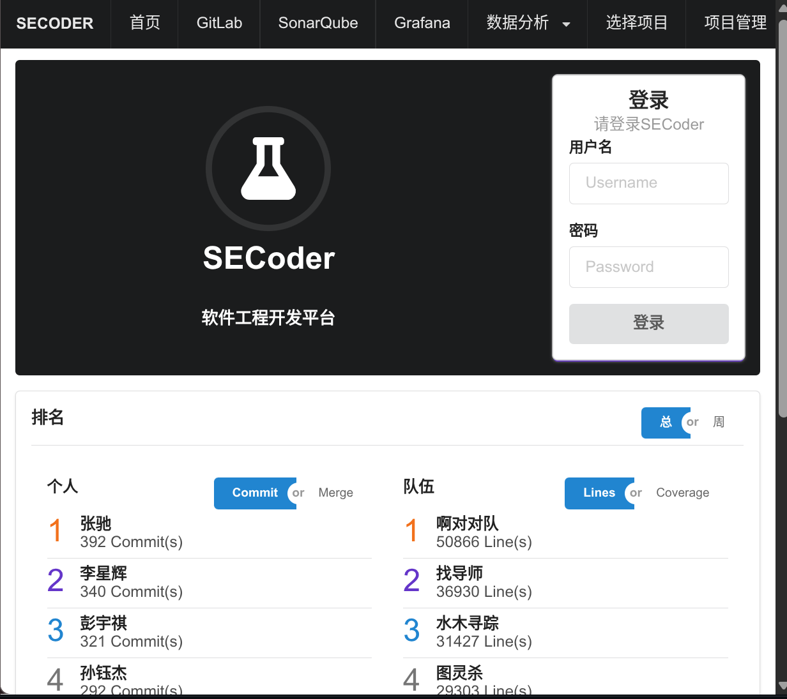
  →
  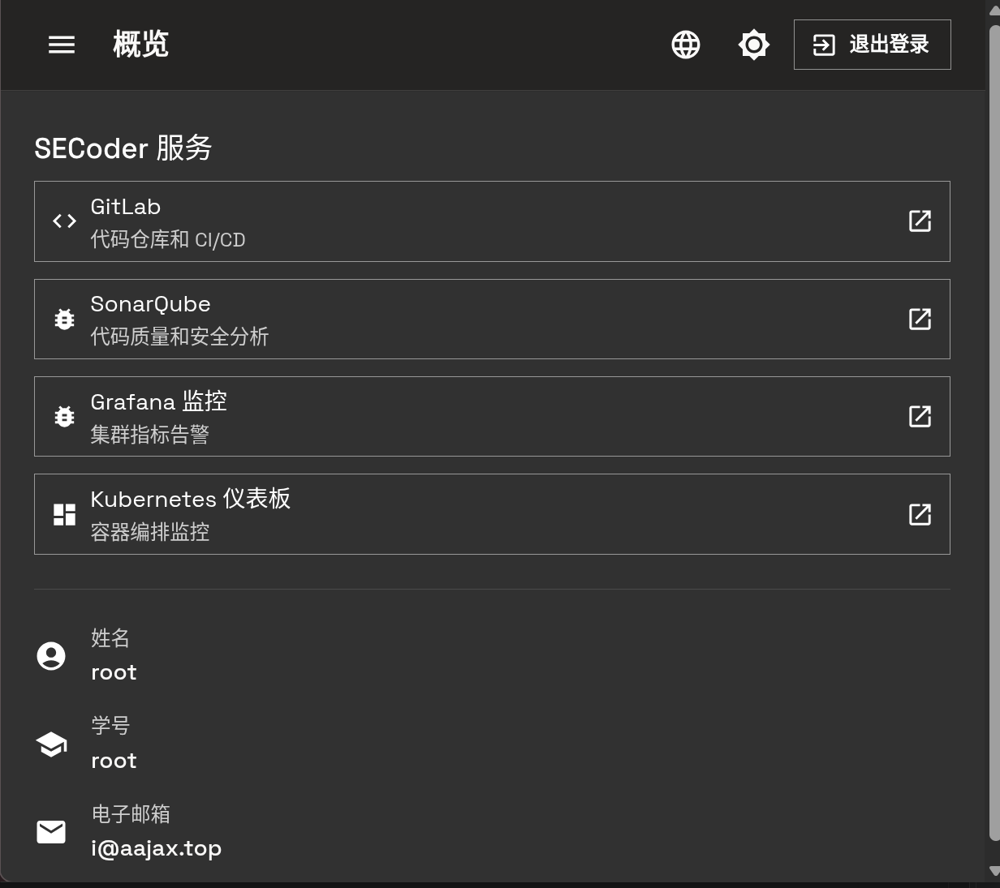

<!--
我们完整重建了 SEcoder, 用现代的前后端重建. UI 现在更好看了, 我们支持三种语言和暗色模式. 而在 UI 的可用性上我们也做了文章, 希望给大家良好的体验.
-->

---

# Components *Updated*

  

    

      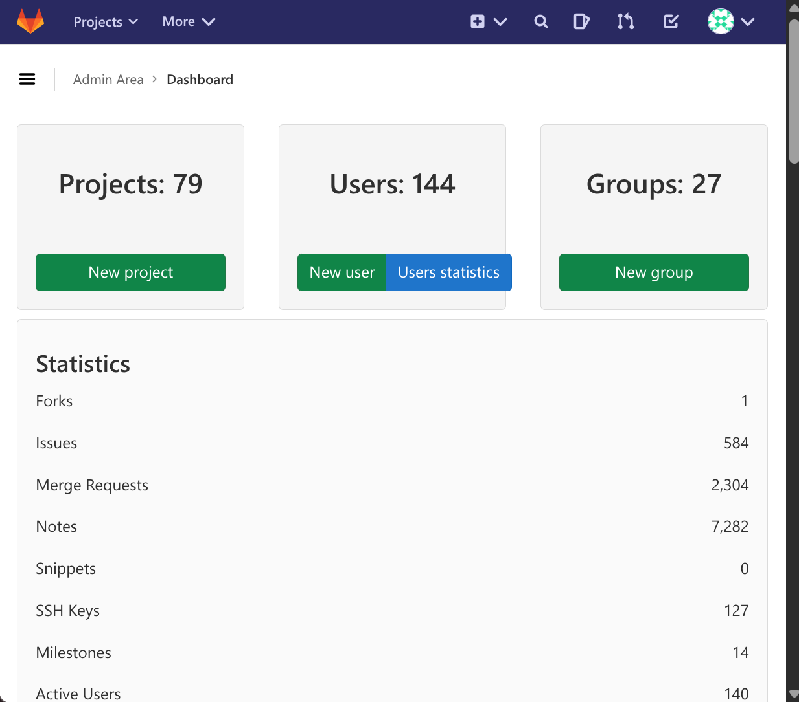
      
GitLab 13.3.0

    

    
→

    

      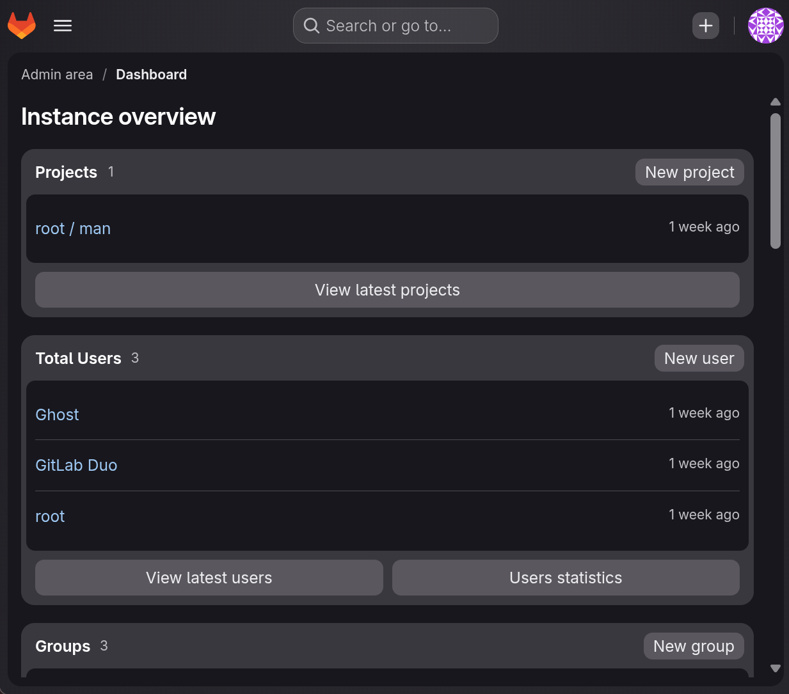
      
GitLab 19.3.0

    

  

  

    

      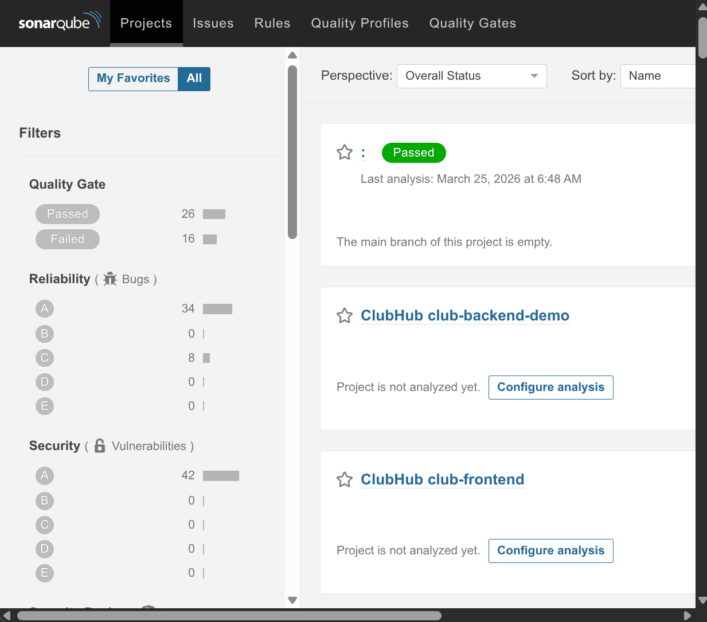
      
SonarQube 8.4.2

    

    
→

    

      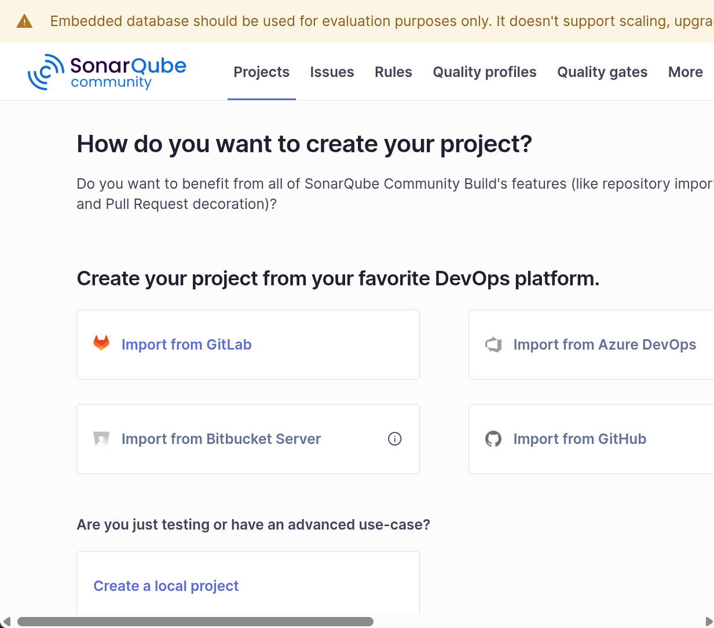
      
SonarQube 26.7.0

    

  

  

    

      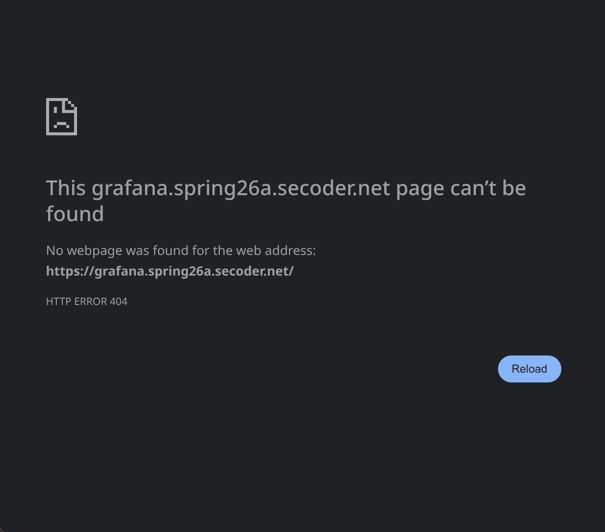
      
*404*

    

    
→

    

      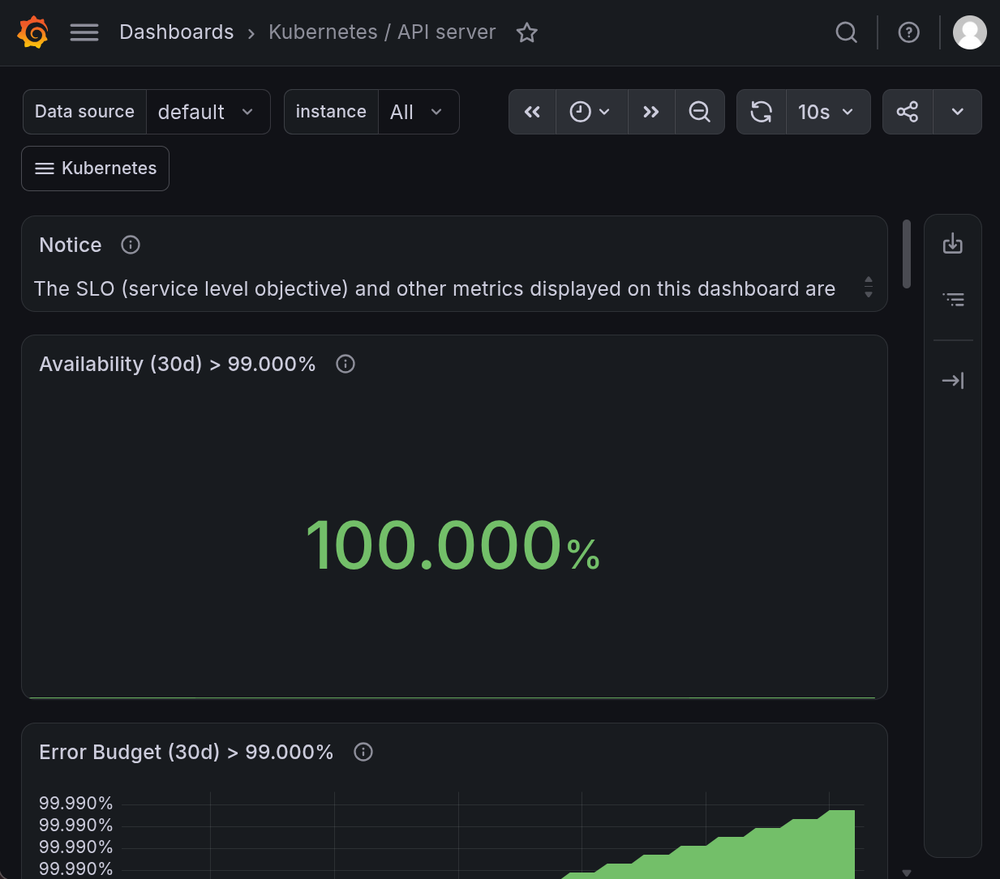
      
Grafana v13.2.0

    

  

  

    

      
      
*手搓的, 坏了*

    

    
→

    

      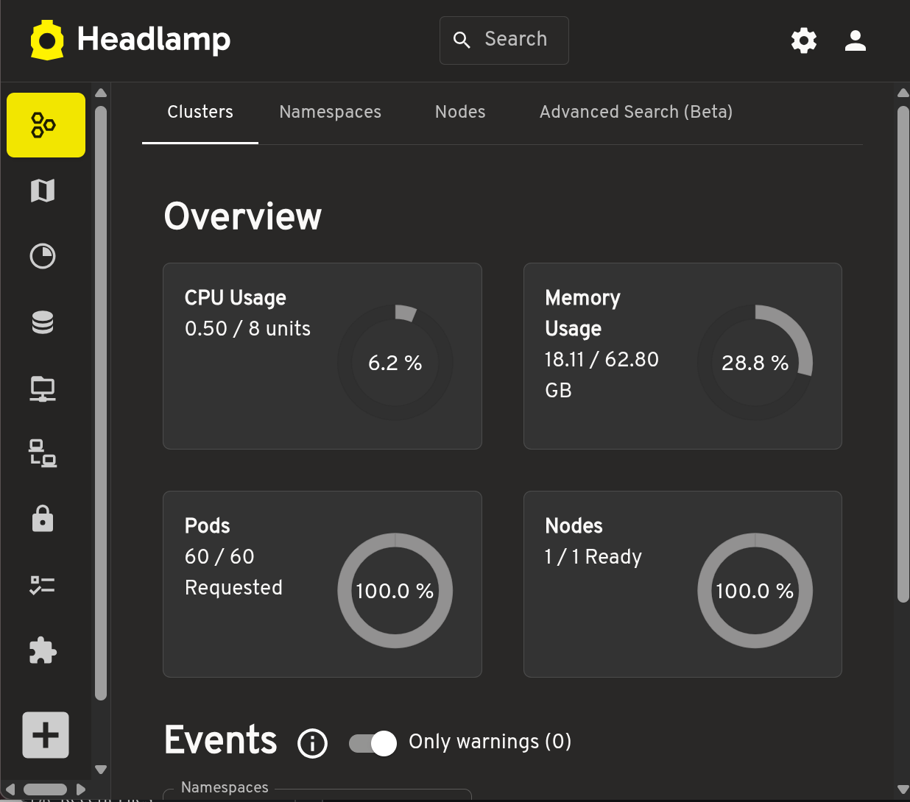
      
Headlamp 0.45.0

    

  

<!--
我们把旧的 SECoder 的各个组件都做了大升级, 核心的 GitLab 和 SonarQube 升级到了最新版 (好吧, 至少是一个月前的最新版), 致力于给大家现代的体验.
我们修好了 Grafana, 里面可以看到集群的历史情况; 引入了 Headlamp 替代旧 SECoder 手搓的一直坏的面板.
在大模型时代, 我们选择尽量使用标准件, 尽量减少定制件, 使得大模型能根据训练数据, 同学们也可以根据网上的大量资料熟悉我们的平台.
对于为数不多的定制件, 我们给出了详尽的文档, 希望大家能通过文档解决大部分问题.
-->

---

# Workflow *Standarized*

  

    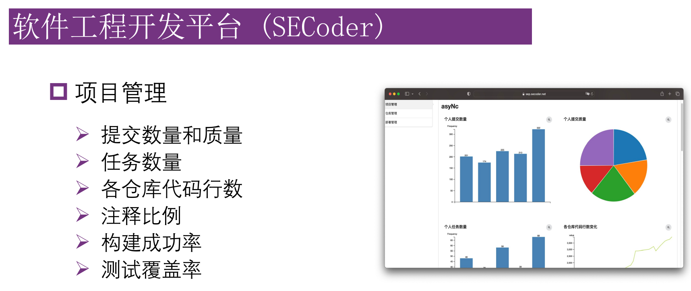
    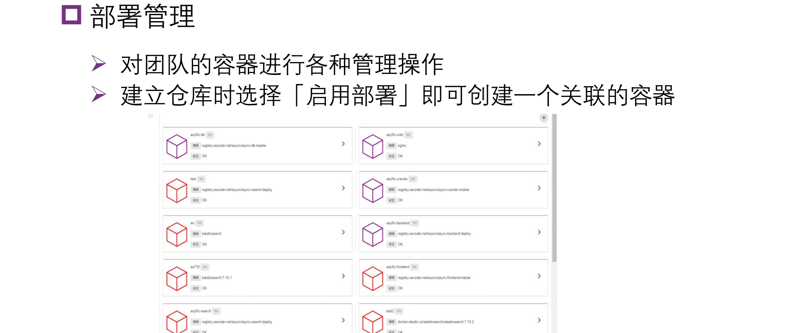
    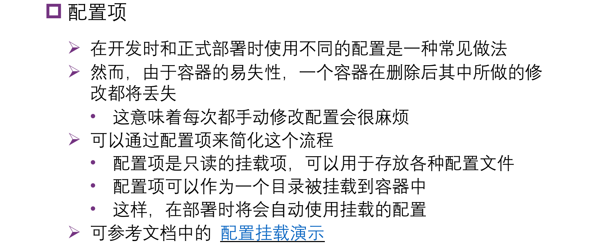
    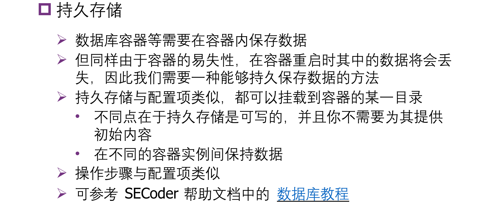
  

  
→

  

    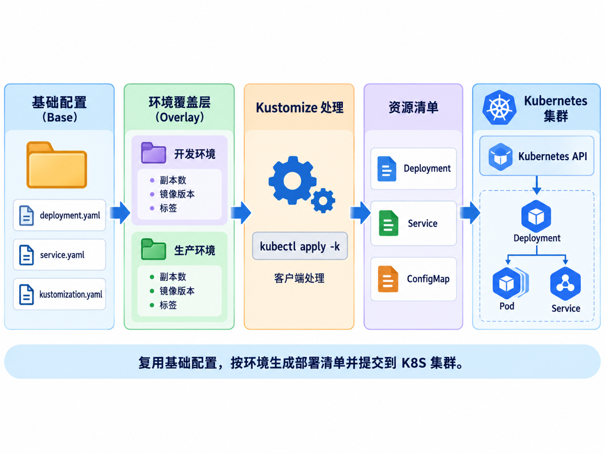
    
*GPT Generated Image

  

<!--
在工作流上, 我们也选用了标准的 K8S 工作流, 即在仓库中存储 Kustomization 文件, 使用 kubectl apply 动态更新. 当然, 现在的公司可能更常用 ArgoCD / FluxCD 一类的 GitOps 方式部署, 简单起见我们省略了这一块.
-->

---
layout: section
---

# Stability *Improved?*

## 这学期是第一次用新 SECoder, 如果炸了怪我

---
