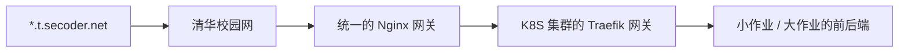
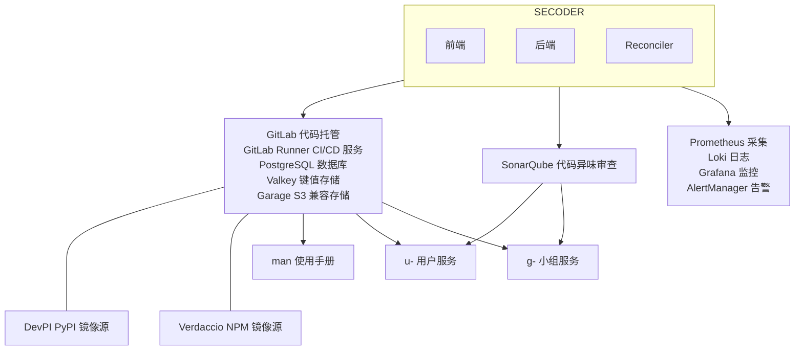
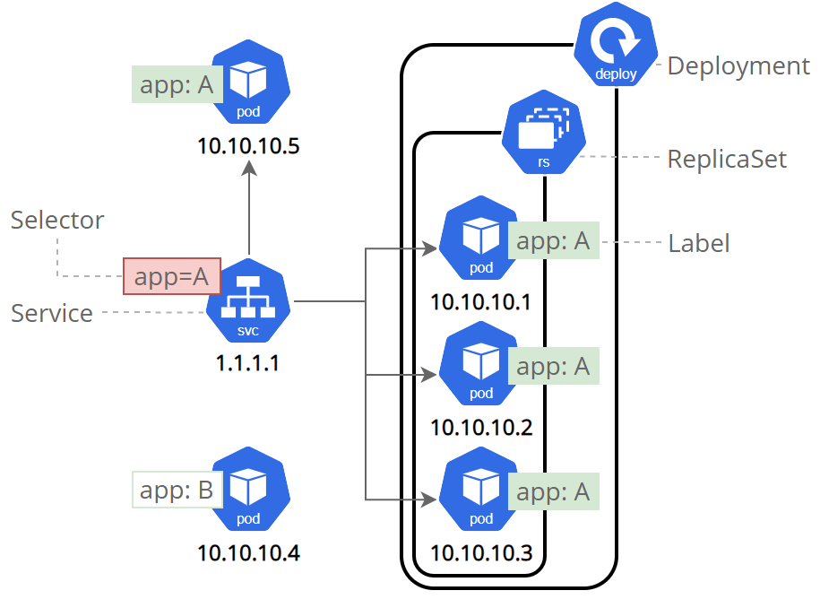
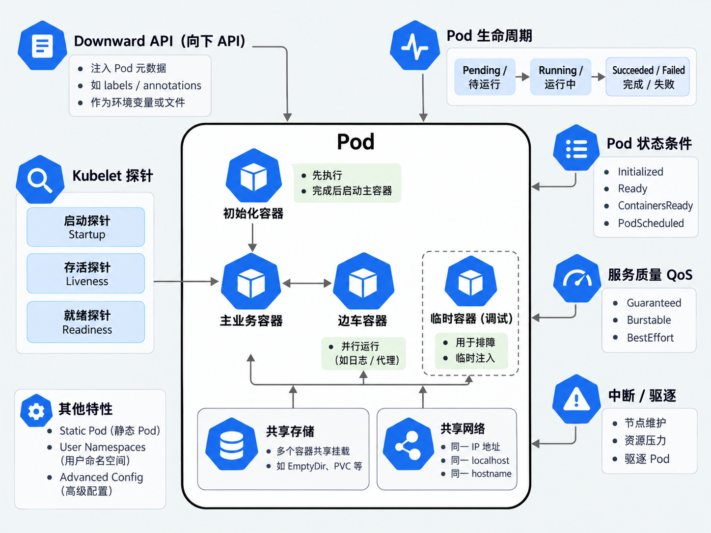
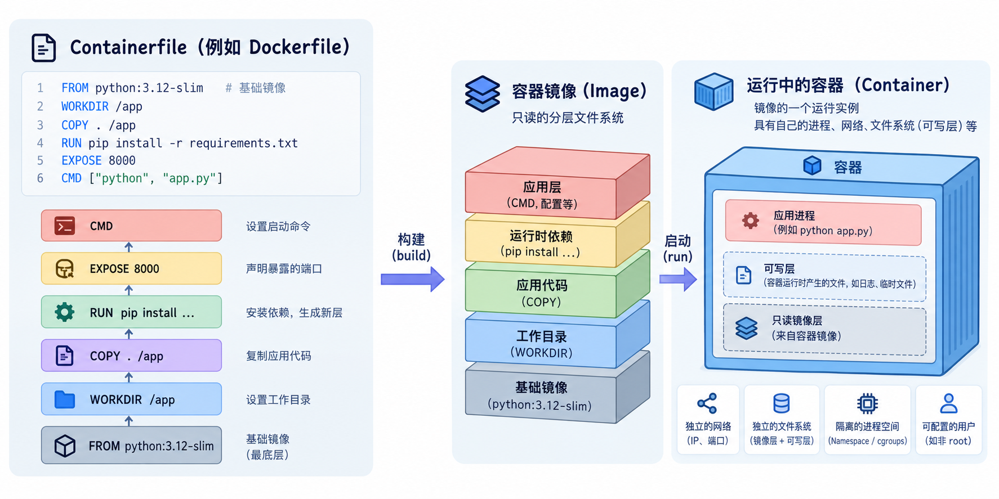

# SECoder   Next Generation

---

# 资料速查

- 平台入口: [t.secoder.net](https://t.secoder.net) (校内访问)
- 平台文档: [thuse-course.github.io/man/](https://thuse-course.github.io/man/) (国内访问性一般); [man.t.secoder.net](https://man.t.secoder.net/) (校内访问)
- GitLab 文档: [docs.gitlab.com](https://docs.gitlab.com/)
- SonarQube 文档: [docs.sonarsource.com](https://docs.sonarsource.com/)
- 容器教程与文档: [Container Internals](https://developers.redhat.com/learn/openshift/container-internals); [Docker 101](https://www.docker.com/101-tutorial/)
- Kubenetes 基础教程: [kubernetes-basics](https://kubernetes.io/docs/tutorials/kubernetes-basics/), [tutorials](https://kubernetes.io/docs/tutorials/)
- 往年资料: [上学期小作业讲 Docker 和 CI/CD](https://thuse-course.github.io/2026-deploy/); [去年讲 Docker 和 CI/CD](https://thuse-course.github.io/2025-deploy/); [暑培讲前后端](https://summer26.net9.org/frontend-and-backend/index_frontend-and-backend/)

 

# 使用方法: 打开 Codex, 把链接丢给他让他讲

---
layout: section
---

# SECoder *Refreshed*

---

# SECoder *Refreshed*

  
  →
  

<!--
我们完整重建了 SEcoder, 用现代的前后端重建. UI 现在更好看了, 我们支持三种语言和暗色模式. 而在 UI 的可用性上我们也做了文章, 希望给大家良好的体验.
-->

---

# Components *Updated*

  

    

      
      
GitLab 13.3.0

    

    
→

    

      
      
GitLab 19.3.0

    

  

  

    

      
      
SonarQube 8.4.2

    

    
→

    

      
      
SonarQube 26.7.0

    

  

  

    

      
      
*404*

    

    
→

    

      
      
Grafana v13.2.0

    

  

  

    

      
      
*手搓的, 坏了*

    

    
→

    

      
      
Headlamp 0.45.0

    

  

<!--
我们把旧的 SECoder 的各个组件都做了大升级, 核心的 GitLab 和 SonarQube 升级到了最新版 (好吧, 至少是一个月前的最新版), 致力于给大家现代的体验.
我们修好了 Grafana, 里面可以看到集群的历史情况; 引入了 Headlamp 替代旧 SECoder 手搓的一直坏的面板.
在大模型时代, 我们选择尽量使用标准件, 尽量减少定制件, 使得大模型能根据训练数据, 同学们也可以根据网上的大量资料熟悉我们的平台.
对于为数不多的定制件, 我们给出了详尽的文档, 希望大家能通过文档解决大部分问题.
-->

---

# Workflow *Standarized*

  

    
    
    
    
  

  
→

  

    
    
*GPT Generated Image

  

<!--
在工作流上, 我们也选用了标准的 K8S 工作流, 即在仓库中存储 Kustomization 文件, 使用 kubectl apply 动态更新. 当然, 现在的公司可能更常用 ArgoCD / FluxCD 一类的 GitOps 方式部署, 简单起见我们省略了这一块.
-->

---
layout: section
---

# Stability *Improved?*

## 这学期是第一次用新 SECoder, 如果炸了怪我

---
layout: section
---
<!-- --- --- --- --- --- --- --- --- --- --- --- --- -->

# The *Vibe* of SECoder

<!--
那在这个 Agentic 的年代我们就不对这些开发流程做过详细的讲解了. 我们就给大家一个 *Vibe*, 也就是一个 Overview, 对我们整个软工开发流程的一个简介.

对以下几张 PPT 的内容你们不一定要逐字全都理解他到底怎么干的, 这只是一个简单的介绍, 告诉你有哪些组件, 在哪些地方有可能出问题. 如果你对其中的任何的部分感兴趣, 你可以让 agent 把我们的仓库拉下来, 去里面找.
-->

---

# Networking

## 问题排查索引:

- Nginx 502 就是 SECoder 平台挂了
- "404 page not found" 一般是 HttpRoute 没有正确配置, 请求到达了 Traefik 之后无处安放
- "no available server" 一般是 HttpRoute 配置正确, 但是后端没有正常启动监听
- 别的乱七八糟的问题一般是服务监听了但是挂了

---

# Components

---

# K8S at a Glance

  

*From https://kubernetes.io/docs/concepts/architecture/

<!--
首先是 K8S 的结构. 一个 K8S 集群可以由多个控制面节点和多个数据面节点构成. 控制面节点主要负责管理集群本身, 比如调度小作业大作业的容器. 简单起见, SECoder 使用了一个节点, 这个节点既是控制面也是数据面.
-->

---

# K8S at a Glance

  

*From https://kubernetes.io/docs/tutorials/kubernetes-basics/expose/expose-intro/
<!--
我们的一个应用常常由一个 Service, 一个 Deployment 或 StatefulSet 和若干个 Pod 组成.

其中, Service 定义如何从外部或内部访问这个应用. SECoder 的外部流量由 Traefik 接入; 同学们的 Service 暴露为 ClusterIP, 由 HTTPRoute 声明转发规则, Traefik 监听并转发请求.

Deployment 和 StatefulSet 都是 Kubernetes 的 Workload 资源, 负责管理一组长期运行的 Pod. 它们根据声明的配置创建、监控、替换和更新 Pod, 让应用保持在期望的运行状态; Service 再为这些 Pod 提供稳定的访问入口.

Pod 是 Kubernetes 中最小的可部署单元, 里面运行一个或多个共享网络和存储的容器. 我们通常不直接管理 Pod, 而是通过 Deployment 或 StatefulSet 管理它们; Pod 出现故障时, Workload 会根据配置重新创建或替换它.
-->

---

# K8S Workloads

| 类型 | 用途 | 常见场景 |
| --- | --- | --- |
| `Deployment` | 管理无状态服务, 支持滚动更新和回滚 | Web 前后端, API 服务 |
| `StatefulSet` | 持续运行, 并为每个 Pod 保留稳定的名字和存储 | 数据库, 消息队列等有状态服务 |
| `Job` | 把一次性任务运行到成功为止, 失败会重试 | 数据迁移, 批处理, 初始化 |

简单区分: `Deployment` 管无状态服务, `StatefulSet` 管有状态服务, `Job` 管一次性任务

---

# Resources

| Resource | u-* | g-* | Capacity |
| --- | ---: | ---: | ---: |
| CPU request / limit (cores) | 128m / 2 | 256m / 8 | 8 |
| Memory request / limit | 256Mi / 4Gi | 512Mi / 16Gi | 64Gi |
| Persistent storage request (PVC) | 10Gi | 10Gi | 256Gi |
| Pods | 10 | 10 | 1024 |
| PVC / Service | 5 / 10 | 5 / 10 | — |
| Secret / ConfigMap | 50 / 50 | 50 / 50 | — |

> **Request**: 预留的空间, 这部分归你独有; **Limit**: 最大的限制, CPU 无法超出, 内存超出 OOM Kill
>
> 用户空间下所有服务的 request 和不能超过用户的 request; 任何一个服务的 limit 不能大于用户的 limit

---

# Inside Pod

  

*Generated By ChatGPT

<!--
Pod 内部可以包括初始化容器, 业务容器, Sidecar 容器等等, 最简单地, 我们就使用一个主业务容器来运行我们的前后端. 在实际生产环境的配置中, 我们常常通过 Sidecar 容器来检查服务负载, 关联到 High Availabiliy 管理器根据负载自动调整 Pod 的副本数量. 同时, 我们用多个探针来检查我们的服务是否就绪, 是否能够正常提供服务, 如果出问题则自动新建副本, 把旧副本杀掉, 维持服务的高可用性.
-->

---

# Inside Container

  

*Generated By ChatGPT

<!--
一个 Container 是一个只读的, 独立的, 可复现的容器镜像的实例. Containerfile 定义了如何生成镜像, 经过构建过程, 即可形成 Image.
-->